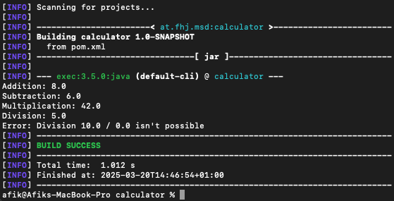
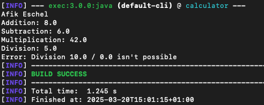

# Exercise 3 - Maven Project Setup

## Steps Taken:
1. Created a new Maven project using the `mvn archetype:generate` command.
2. Initialized a Git repository in the project folder.
3. Connected the local repository to a remote GitHub repository.
4. Documented the process in this file.

### New Folder:
After building the project, a `target/` folder was created.

### Compile and build success:
After compiling, the build was successful. 

### build success with name:
After running the `mvn exec:java` command, the following output was displayed in the console:

