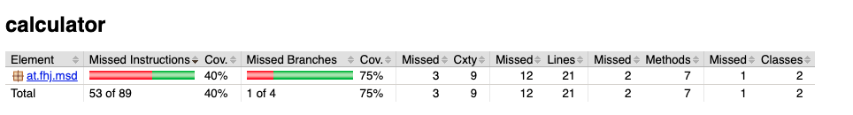
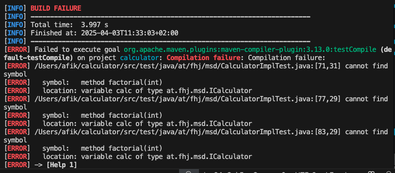

# Exercise 4 - Source Code Testing

## Steps Taken:
1. Reviewed the code and ensured the `target/` folder is ignored using `.gitignore`.
2. Set up JUnit 5 in `pom.xml` with the required dependencies.
3. Created a new test folder structure: `src/test/java/at/fhj/msd`.
4. Created a test class `CalculatorImplTest.java`.
5. Implemented unit tests for the `add()`, `subtract()`, `multiply()`, and `divide()` methods.
6. Ran tests successfully using `mvn test`.
7. Generated test coverage report using the JaCoCo Maven plugin.

## Tested Methods and Cases:

### `add(double, double)`
- `testAddNormalValues`: 2.0 + 3.0 → 5.0
- `testAddWithZero`: 0.0 + 0.0 → 0.0
- `testAddWithNegative`: -2.0 + 3.0 → 1.0

### `subtract(double, double)`
- `testMinusNormalValues`: 5.0 - 3.0 → 2.0

### `multiply(double, double)`
- `testMultiplyNormalValues`: 4.0 * 2.5 → 10.0

### `divide(double, double)`
- `testDivideNormalValues`: 10.0 / 2.0 → 5.0
- `testDivideByZero`: 10.0 / 0.0 → should throw `ArithmeticException`

## Test Coverage Report:

Screenshot of the JaCoCo coverage report:

## Factorial (Test-Driven Development)

The `factorial(int n)` method was implemented using the TDD approach.

### Test Cases

| Testname              | Input | Expected | Description                              |
|-----------------------|-------|----------|------------------------------------------|
| testFactorialFive     | 5     | 120.0    | Standard case, factorial of 5            |
| testFactorialZero     | 0     | 1.0      | Edge case, factorial of 0                |
| testFactorialNegative | -1    | 0.0      | Invalid input, returns 0 for negative    |

A screenshot showing the failing tests before implementation was saved as:

