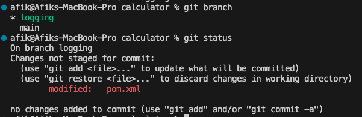
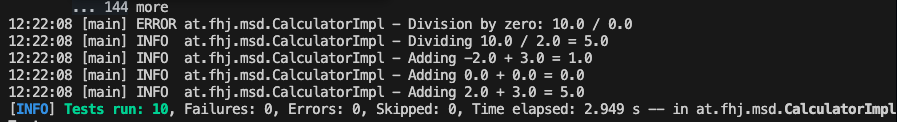
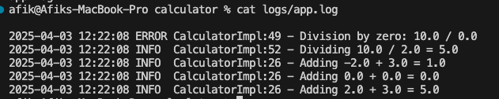

# Exercise 5 - Git Branching & Logging

## Steps Taken:

1. Updated `.gitignore` to exclude build and log files.
2. Created a new branch `logging` from `main`.
3. Added Log4J2 dependencies to `pom.xml`.
4. Created `log4j2.xml` configuration file in `src/main/resources`.
5. Implemented logging in `CalculatorImpl.java` using `logger.info()` and `logger.error()`.
6. Verified log output in console and `logs/app.log`.
7. Merged `logging` branch back to `main`.
8. Created `documentation` branch to write this file.

## Why use a logging library like Log4J?

- Structured logging (levels like info, error, debug)
- Logs to multiple targets (console, file, etc.)
- Easy to turn on/off without changing code
- Better than `System.out.println()` for debugging

## Log4J Logging Levels (common ones)

- `TRACE`: Very detailed
- `DEBUG`: For developers
- `INFO`: General application flow
- `WARN`: Something unexpected, but not an error
- `ERROR`: Something failed
- `FATAL`: System crash or critical issue

## Configuration Options in `log4j2.xml`

- Appenders:
  - Console: output to terminal
  - File: output to `logs/app.log`
- Layout: controls message format (timestamp, level, logger, message)
- Root logger: controls what minimum level is logged

## Screenshots

### Modified `pom.xml` on logging branch

### Console output with log entries

### Contents of `logs/app.log`

