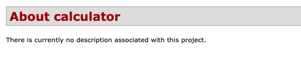
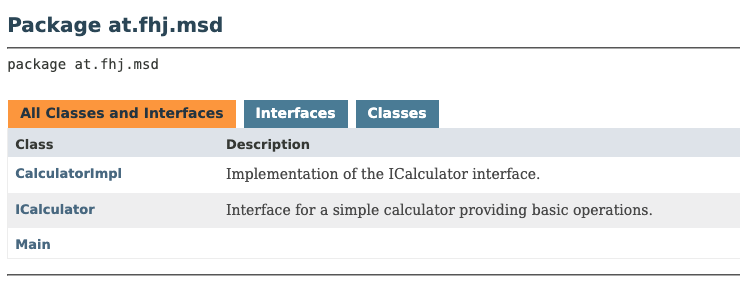
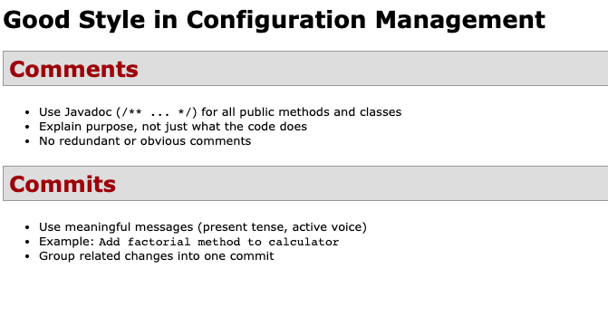
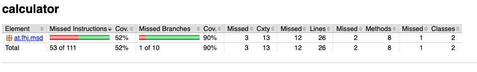
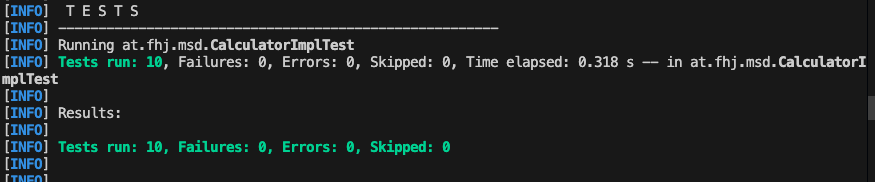

# Exercise 6 - Documentation and Site

## What was done:
- Added Javadoc comments to all calculator files
- Set up Maven Site plugin
- Created site.xml and navigation
- Created good_style.md and this file
- Built and tested Maven Site with screenshots

## What did I learn:
- How to write proper Javadoc
- How to structure documentation with Maven
- Importance of readable commits and comments

## Challenges:
- Remembering where to put the files
- Fixing build errors with plugins

## Screenshots:

